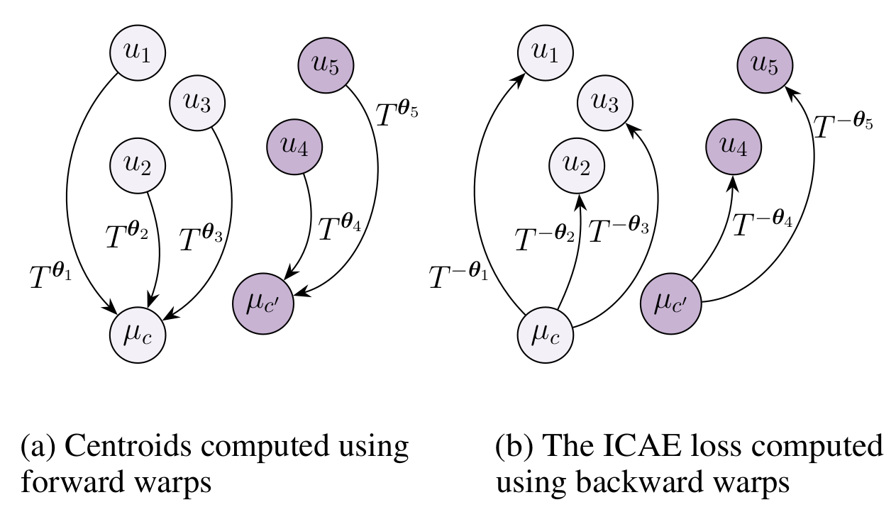
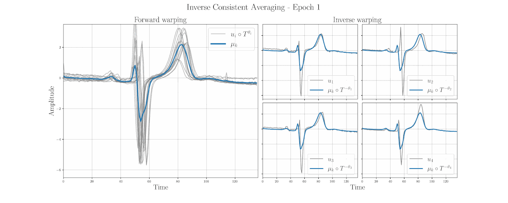

# Regularization-free Diffeomorphic Temporal Alignment Nets
Official PyTorch implementation for our upcoming ICML 2023 paper, Regularization-free Diffeomorphic Temporal Alignment Nets.

## The Inverse Consistency Averaging Error


## Forward and Inverse Alignment


## Time Series Joint Alignment 


## Installation

1. Clone the repository:

   ```shell
   git clone https://github.com/BGU-CS-VIL/RF-DTAN.git
   ```

2. Create a new conda environment:

   ```shell
   conda create --name rfdtan python=3.9
   ```

3. Activate the conda environment:

   ```shell
   conda activate rfdtan
   ```

4. Install the required dependencies:

   ```shell
   pip install -r requirements.txt
   ```

## Usage

To run the training process, execute the following command:

```shell
python train_model.py --dataset ECGFiveDays --ICAE_loss
```

Replace `ECGFiveDays` with the desired dataset name and add any additional arguments as needed.

We support the following losses: 
- ICAE_loss
- ICAE_triplet_loss
- WCSS_loss
- WCSS_triplet_loss
- smoothness_prior

ICAE - Inverse Consistecny Averaging Error 

WCSS - Within-Class Sum of Squares

### Requirements
```shell
difw==0.0.29
matplotlib==3.5.1
numpy==1.20.3
scikit_learn==1.0.2
torch==1.10.1
tqdm==4.62.3
tsai==0.2.24
tslearn==0.5.2
```

