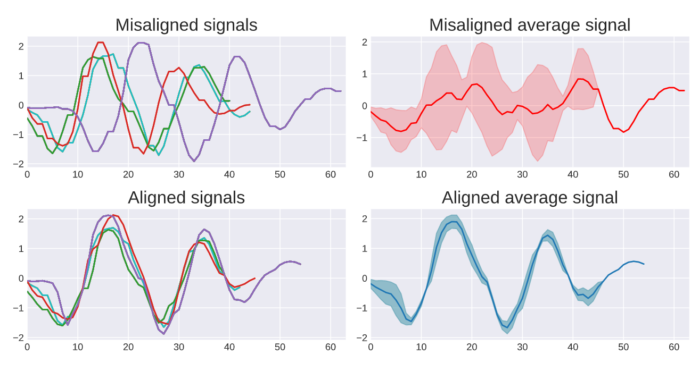

# Regularization-free Diffeomorphic Temporal Alignment Nets
Official PyTorch implementation for our upcoming ICML 2023 paper, Regularization-free Diffeomorphic Temporal Alignment Nets.

## The Inverse Consistenct Averaging Error


## Time Series Joint Alignment 



```markdown
# Repository Name

This repository contains code for the EFD-TAN (Example Feature-based Diffeomorphic Temporal Alignment Nets) project.

## Installation

1. Clone the repository:

   ```shell
   git clone https://github.com/your-username/repository.git
   ```

2. Create a new conda environment:

   ```shell
   conda create --name efdtan python=3.9
   ```

3. Activate the conda environment:

   ```shell
   conda activate efdtan
   ```

4. Install the required dependencies:

   ```shell
   pip install -r requirements.txt
   ```

## Usage

To run the training process, execute the following command:

```shell
python train_model.py --dataset ECGFiveDays --ICAE_loss
```

Replace `ECGFiveDays` with the desired dataset name and add any additional arguments as needed.

```

